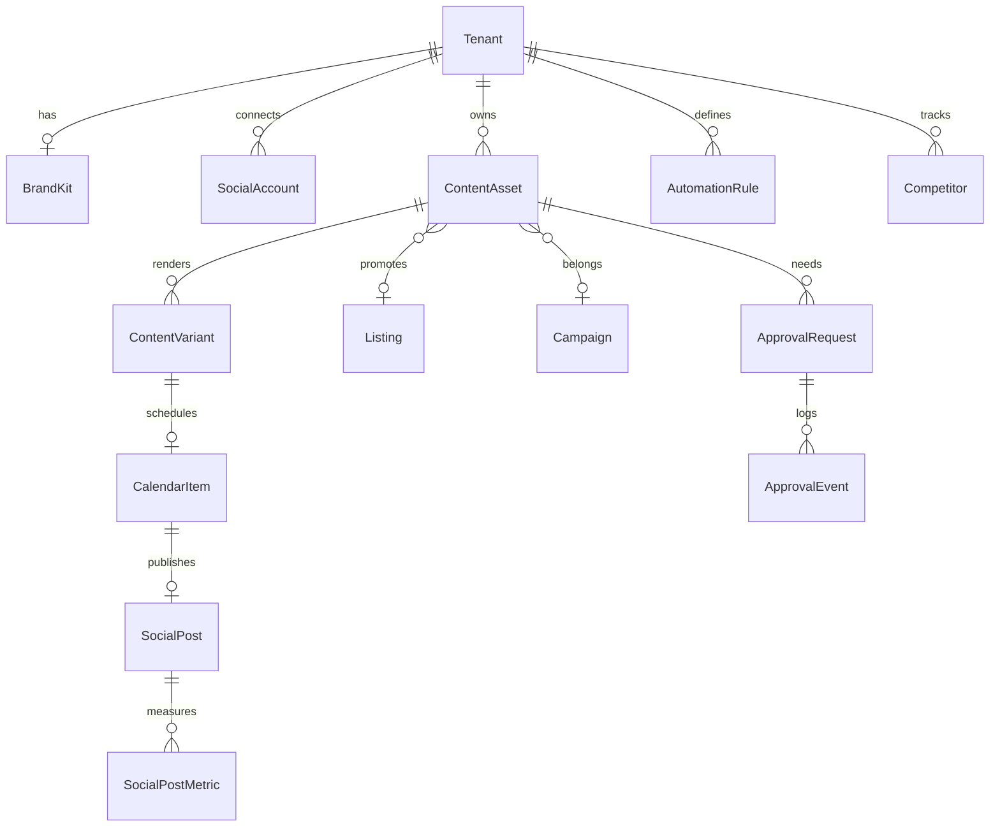

# Emlakflow OS — AI Social Media Operating System

> **Module codename:** `Social OS` · **Route root:** `/sosyal` · **Status:** Blueprint (extends existing `/icerik`, `SocialAccount`/`SocialPost`, AI Stüdyo)  
> **Stack lock-in:** Next.js 15 · React 19 · Tailwind v4 · Prisma 6 · Neon · next-auth v5 · AI SDK · R2 · QStash · Recharts · dnd-kit  
> **Design tokens:** `--app-brand-fill` (#1e5b3e / dark #2e7550), `--app-*` glass surfaces, dark-mode first for this module, light parity required.

This document is the single source of truth for building the real-estate-native AI Social Media OS inside Emlakflow. It does **not** greenfield a second product — it upgrades the existing social + studio foundation into a category-defining operating surface.

---

## 0. Reality Check (what already ships)

| Capability | Status | Anchor |
|---|---|---|
| Meta IG/FB OAuth + insights sync | ✅ Partial | `lib/social.ts`, `app/api/social/*` |
| Social posts + metrics time series | ✅ Partial | `SocialPost`, `SocialPostMetric` |
| Content list UI | ✅ Thin | `app/(app)/icerik`, `social-content-panel.tsx` |
| AI photo / video / voice | ✅ Strong | `app/(app)/dashboard/studio`, `StudioJob`, `lib/studio-prompts.ts` |
| Brand-ish office fields | 🟡 Thin | `Tenant.brandName`, `office-brand.ts`, showcase settings |
| Multi-tenant isolation | ✅ | `forTenant()`, session `tenantId` |
| Plans + AI credits | ✅ | `lib/plans.ts` `STUDIO_ALLOTMENT`, `CREDIT_TOPUP_PACKS` |
| Calendar / Kanban primitives | ✅ Reusable | `ajanda`, `@dnd-kit`, `kanban-board.tsx` |
| LinkedIn / TikTok publish / planner / approvals / brand kit / competitor AI | ⛔ | Build |

**Strategic bet:** Competitors sell “schedule posts.” Emlakflow sells **inventory-aware marketing automation** — every piece of content is born from a listing, project, brand kit, or CRM event.

---

## 1. Product Vision

### North Star
> Every listing, every project, every launch date automatically becomes a week of on-brand, multi-channel content — written, designed, approved, scheduled, published, measured, and improved — without a social media manager.

### Positioning
**Emlakflow Social OS** = Linear (craft) × ChatGPT (intelligence) × Notion (clarity) × Apple (premium) × Buffer (reliability) — purpose-built for real estate agencies and developers.

### Moats vs Buffer / Hootsuite / Metricool / Later / Predis / Ocoya / Publer / Blaze

1. **Inventory graph** — content is linked to `Listing`, availability, price changes, stages.
2. **Studio pipeline** — photo staging + Veo/Shotstack video already in-product (others bolt on Midjourney).
3. **CRM loop** — leads from social → `Lead`/`Contact` → deal → more content.
4. **Turkish real-estate vernacular** — captions, legal CTAs, holiday calendar (TR + Gulf + EU markets).
5. **Approval that matches agencies** — Marketing → Broker → Owner → Client (developer).
6. **Credit economy already proven** — image allotments + video packs map cleanly to Social OS usage.

### Product promise (one sentence)
Open a listing → Social OS proposes 30 days of posts, reels, stories, emails, and ads → one approval → auto-publish → ROI tied back to inquiries.

---

## 2. User Journey

### Personas
| Persona | Goal | Primary surface |
|---|---|---|
| Agency Owner | Brand consistency + ROI | Dashboard, Reports, Approvals |
| Marketing Manager | Volume + calendar | Planner, Calendar, AI Chat |
| Sales Agent | Promote *my* listings | “Promote listing” from Portföy |
| Developer Marketing | Launch campaigns | Campaigns, Brand Center, Approvals (client) |
| Freelancer / Solo broker | Speed | AI Generate → Schedule → Done |

### Golden path (agent, 8 minutes)
1. Opens Portföy → listing “Villa Bodrum” → **Sosyal’e Gönder**
2. AI Marketing Brain loads brand voice + city season + inventory status
3. Generator returns: 12 IG posts, 4 reels storyboards, 6 stories, 2 LinkedIn, 1 email, hashtags, image/video prompts
4. Agent swaps 2 slides, picks luxury tone
5. Sends to Approval (Broker)
6. Broker approves → Smart Planner places at best times (30-day)
7. Auto-publish via Meta + manual queue for TikTok
8. Analytics: reach → profile visits → vitrin leads tagged `utm_source=social`

### System journey (event-driven)
```
Listing.created | Listing.status→ACTIVE | price drop | open house
        ↓
Automation rule fires
        ↓
AI Agents (Strategist → Writer → Designer → Planner)
        ↓
Draft pack (ContentAsset[])
        ↓
ApprovalWorkflow (optional by plan/role)
        ↓
Calendar slots (best-time model)
        ↓
Publisher workers (QStash)
        ↓
Metric sync cron → Insights → next recommendations
```

---

## 3. Information Architecture

### Nav group: **Büyüme** (Growth)
Insert into `components/nav-items.ts` as a grouped nav (Vision 2.0 already demands grouping):

```
Büyüme
├── Sosyal            /sosyal              (hub dashboard)
├── Planlayıcı        /sosyal/planlayici
├── Takvim            /sosyal/takvim
├── AI Sohbet         /sosyal/sohbet
├── Medya             /sosyal/medya
├── Şablonlar         /sosyal/sablonlar
├── Kampanyalar       /sosyal/kampanyalar
├── Otomasyon         /sosyal/otomasyon
├── Onay Merkezi      /sosyal/onaylar
├── Analitik          /sosyal/analitik
├── Rakipler          /sosyal/rakipler
├── Marka Merkezi     /sosyal/marka
├── Raporlar          /sosyal/raporlar
└── Entegrasyonlar    /sosyal/entegrasyonlar
```

Deprecate thin `/icerik` → redirect to `/sosyal` (keep query `?connected=`).

### Screen map (every page)

| Screen | Job | Key components |
|---|---|---|
| Hub Dashboard | Today’s queue, AI suggestions, health | `SocialHeroStats`, `QueueStrip`, `AiBriefCard` |
| Planner | Generate / edit content packs | `ContentComposer`, `PlatformTabs`, `AssetGrid` |
| Calendar | DnD month/week/day/kanban/timeline | `SocialCalendar`, reuse dnd-kit |
| Media Library | Assets from R2 + studio + uploads | `MediaBrowser`, folders, tags |
| AI Chat | Multi-agent chat over tenant context | `AgentSwitcher`, tool-calling UI |
| Analytics | Reach, engagement, leads, ROI | Recharts + insight cards |
| Brand Settings | Kit that auto-applies | Color/font/voice editors |
| Approval Center | Inbox of pending items | Thread + version diff |
| Templates | Industry packs | Template gallery |
| Campaigns | Launch / seasonal / project | Campaign builder |
| Automation | If-this-then-that for listings | Rule builder |
| Reports | W/M/Q/Y export | PDF/Excel/share |
| Integrations | OAuth + webhooks | Connection cards |
| Notifications | Social-specific | Extend `Notification` |
| Settings | Defaults, quiet hours, roles | Nested under `/ayarlar/sosyal` |

### Mobile
Bottom sheet composer, swipe approve/reject, calendar day strip, sticky “AI üret” FAB. PWA already via `@ducanh2912/next-pwa`.

---

## 4–5. Database Schema & Tables

Additive models (full Prisma fragment: `docs/ai-social-os/schema.fragment.prisma`).

### Core entities
- `BrandKit` — logos, colors, fonts, voice, photography rules (1:1 Tenant)
- `ContentAsset` — universal creative unit (caption pack + media refs + prompts)
- `ContentVariant` — per-platform render of an asset
- `ContentPlan` — 30/60/90-day plan container
- `CalendarItem` — scheduled slot (DnD entity)
- `Campaign` — themed collection + budget/goal
- `ApprovalRequest` + `ApprovalEvent` — workflow + history
- `AutomationRule` + `AutomationRun`
- `Competitor` + `CompetitorPost`
- `SocialAgentSession` + `SocialAgentMessage` — AI chat
- `SocialReport`
- Extend `SocialPlatform` enum: `LINKEDIN`, `THREADS`, `X`, `PINTEREST`, `GOOGLE_BUSINESS`, `EMAIL`, `BLOG`
- Extend `SocialPost`: `status`, `scheduledAt`, `assetId`, `variantId`, `campaignId`, `utm`, publish errors

### ER (logical)

```
Tenant ─┬─ BrandKit
        ├─ SocialAccount ── SocialPost ── SocialPostMetric
        ├─ ContentAsset ── ContentVariant ── CalendarItem ── SocialPost
        ├─ ContentPlan ── CalendarItem
        ├─ Campaign ── ContentAsset
        ├─ ApprovalRequest ── ApprovalEvent
        ├─ AutomationRule ── AutomationRun
        ├─ Competitor ── CompetitorPost
        └─ Listing ── (optional FK on ContentAsset / SocialPost)
```

---

## 6. API Architecture

### Route conventions (App Router)
```
app/api/social/
  accounts/          GET, DELETE
  connect/           GET (OAuth start)
  callback/          GET
  posts/             GET, POST, PATCH, DELETE
  publish/           POST          # immediate
  schedule/          POST          # enqueue QStash
  best-time/         GET
  assets/            CRUD
  plans/             CRUD + generate
  calendar/          GET, PATCH (move)
  campaigns/         CRUD
  approvals/         GET, POST (decide)
  automations/       CRUD + test
  brand/             GET, PUT
  media/             list + sign upload
  analytics/         GET aggregates
  competitors/       CRUD + sync
  reports/           POST generate
  agents/chat/       POST stream (AI SDK)
  website/ingest/    POST analyze URL/PDF
```

### Workers (QStash / cron)
| Job | Trigger | Action |
|---|---|---|
| `social.publish` | scheduledAt | Platform publish adapter |
| `social.metrics.sync` | hourly | Extend existing metric sync |
| `social.token.refresh` | daily | Long-lived token refresh |
| `social.automation` | listing events | Fire rules |
| `social.competitor.sync` | nightly | Scrape/API ingest |
| `social.plan.rollforward` | weekly | Extend 90-day plans |

### Adapters
```ts
interface PublishAdapter {
  platform: SocialPlatform;
  publish(variant: ContentVariant, account: SocialAccount): Promise<PublishResult>;
  fetchMetrics(externalId: string, account: SocialAccount): Promise<MetaMediaInsight>;
}
```
Ship order: Meta (IG/FB) → LinkedIn → Google Business → TikTok → YouTube → Threads/X → Pinterest.

---

## 7. Folder Structure

```
app/(app)/sosyal/
  page.tsx                    # hub
  planlayici/page.tsx
  takvim/page.tsx
  sohbet/page.tsx
  medya/page.tsx
  sablonlar/page.tsx
  kampanyalar/[id]/page.tsx
  otomasyon/page.tsx
  onaylar/page.tsx
  analitik/page.tsx
  rakipler/page.tsx
  marka/page.tsx
  raporlar/page.tsx
  entegrasyonlar/page.tsx
  ayarlar/page.tsx

components/social/
  shell/                      # sidebar section, header chips
  dashboard/
  planner/
  calendar/
  media/
  agents/
  analytics/
  brand/
  approvals/
  campaigns/
  automation/
  reports/
  ui/                         # glass cards, platform pills

lib/social/
  index.ts                    # re-export existing meta helpers
  platforms/                  # adapters
  best-time.ts
  planner.ts                  # 30/60/90 generator
  brand-apply.ts
  approvals.ts
  automations.ts
  analytics.ts
  competitors.ts
  utm.ts
  credits.ts                  # map to STUDIO_ALLOTMENT + new social credits

lib/social-agents/
  registry.ts                 # agent definitions
  tools.ts                    # listing search, brand, schedule…
  prompts/                    # system prompts per agent

app/actions/social-*.ts       # server actions (mutations)
```

---

## 8–12. UI Components, Wireframes, Hi-Fi, Dashboard, Mobile

### Design system (Social OS layer on existing tokens)

| Token | Use |
|---|---|
| `bg-paper` / dark `--app-bg` | Canvas |
| `bg-brand-600` / `--app-brand-fill` | Primary CTA |
| Glass: `bg-white/70 dark:bg-white/5 backdrop-blur` | Panels |
| `rounded-2xl` | Cards that are interactive only |
| `font-display` | Titles |
| Platform colors | Tiny dots only — never rainbow UI |

**Rules (align with product):** dark-first for `/sosyal`, no purple AI cliché, no emoji in chrome (emoji only inside generated copy), motion: calendar drag ghost, approve slide, composer stream fade-in (2–3 intentional motions).

### Component inventory (ship-critical)
`PlatformIcon`, `StatusPill`, `GlassPanel`, `Composer`, `CaptionField`, `HashtagChips`, `CarouselEditor`, `StorySequence`, `ReelStoryboard`, `MediaDropzone`, `CalendarBoard`, `KanbanQueue`, `ApprovalCard`, `AgentAvatar`, `InsightCallout`, `CompetitorRadar`, `BrandSwatchEditor`, `CreditMeter`, `BestTimeHeatmap`.

### Wireframe — Hub (desktop)
```
┌ Sidebar │ Header: Sosyal · Credits · Connect ──────────────┐
│ Büyüme  ├──────────────────────────────────────────────────┤
│ ·Sosyal │  AI Brief (today)          │ Queue (next 7)      │
│ ·Plan   │  ────────────────────────  │ ○ IG 10:00 Villa…   │
│ ·Takvim │  Stats: Reach Eng Leads    │ ○ FB 14:00 …        │
│ ·…      │  Top suggestion CTA        │ ○ LI tomorrow       │
│         │  Recent studio outputs ──► Promote               │
└─────────┴──────────────────────────────────────────────────┘
```

### Wireframe — Composer
Left: context (listing / brand / campaign). Center: streaming AI output structured as blocks (Headline, Caption, CTA, Hashtags, Image prompt…). Right: live platform preview (IG / Reel / LinkedIn). Bottom bar: Save draft · Send approval · Schedule · Publish.

### Mobile
Single column; preview as bottom sheet; approve via swipe; calendar = horizontal day chips.

---

## 13. User Flows (critical)

1. **Listing → 50 posts** — ingest listing + media → Marketing Brain → asset pack → plan
2. **Website repurpose** — URL/PDF → extract → 50 assets
3. **Approval** — draft → request → comment/revise → approve → schedule
4. **Best time** — analytics heatmap → planner auto-slot
5. **Automation** — new ACTIVE listing → rule → draft pack → optional auto-schedule
6. **Competitor** — add handle → sync → “beat this post” remix
7. **Report share** — monthly PDF + public token link

---

## 14. AI Workflows

### Marketing Brain (tenant profile job)
Inputs: BrandKit, top listings, city, vertical, plan goals, past top posts.  
Outputs: `MarketingStrategy` JSON (pillars, cadence, tones, forbidden claims, seasonal hooks). Cached 7 days; invalidate on BrandKit change.

### Generation pipeline (one asset)
```
Context pack → Strategist (angle) → Copywriter (tone) → Designer (visual prompts)
→ Video Creator (if reel) → SEO Expert (keywords) → Social Manager (posting recs)
→ Structured ContentAsset
```

### Structured output contract (every generation)
```json
{
  "headline": "",
  "caption": "",
  "cta": "",
  "emojiStrategy": "",
  "hashtags": [],
  "seoKeywords": [],
  "imagePrompt": { "midjourney": "", "flux": "", "imagen": "", "gptImage": "", "ideogram": "" },
  "videoPrompt": "",
  "thumbnailIdea": "",
  "carouselSlides": [{ "order": 1, "text": "", "visual": "" }],
  "storySequence": [{ "order": 1, "text": "", "durationSec": 5 }],
  "postingRecommendation": { "platforms": [], "bestTimesLocal": [], "reason": "" }
}
```

### Website / PDF ingest
1. Fetch + readability extract (or PDF parse)
2. Chunk → embedding optional later
3. Entity extract: projects, USPs, CTAs, legal disclaimers
4. Generate N assets with source citations stored on `ContentAsset.sourceRefs`

---

## 15. Automation Logic

### Triggers
`listing.created`, `listing.activated`, `listing.price_changed`, `listing.status_sold`, `open_house.scheduled`, `campaign.launched`, `inventory.low`, `holiday.approaching`, `studio.job.succeeded`.

### Actions
`generate_pack`, `create_plan_slots`, `request_approval`, `schedule`, `notify_slack`, `create_task`, `send_email_newsletter_draft`.

### Guardrails
- Quiet hours from BrandKit
- Max daily publishes per platform (plan-gated)
- Forbidden phrases / licensed claim checker
- Human-in-loop default on Free/Pro; Premium can enable auto-publish

---

## 16–17. Backend & Frontend Architecture

### Backend
- **Sync path:** Server Actions + Route Handlers with `getSession()` + `forTenant()`
- **Async path:** QStash signatures verified; idempotent `publishAttemptId`
- **AI:** Vercel AI SDK (`ai` + `@ai-sdk/openai`) already in repo; add Anthropic/Gemini providers behind `lib/ai-provider-registry.ts`
- **Media:** R2 signed uploads (existing `lib/r2.ts`)
- **Realtime:** optional later via Supabase Realtime or polling; MVP = revalidate + optimistic UI
- **Redis:** Upstash for rate limits / best-time cache (rate-limit lib exists)

### Frontend
- Server Components for hubs; Client islands for calendar/composer/chat
- Stream UI for agent chat (`useChat` pattern)
- Reuse `EmptyState` / skeletons from Vision P0
- Command palette: add Social actions (“Planla: Villa Bodrum”, “Onay bekleyenler”)

---

## 18. Prompt Library

See `docs/ai-social-os/prompt-library.ts` — includes:
- Agent system prompts (14 agents)
- Real-estate vertical packs (luxury villa, rental, commercial, developer launch, open house, holiday)
- Image prompt scaffolds (villa, drone, night render, interior…)
- Video storyboard scaffolds (hook → tour → CTA)
- Tone presets: luxury, corporate, friendly, professional, minimal, emotional, urgent, premium, high-converting

---

## 19–20. Tables & ER Diagram

See §4 and `schema.fragment.prisma`. Mermaid:



---

## 21. Security Model

| Layer | Rule |
|---|---|
| Auth | `getSession()` required on all `/api/social/*` mutations |
| Tenancy | Every query through `forTenant(tenantId)`; never trust client tenantId |
| Tokens | Encrypt `SocialAccount.accessToken` at rest (AES-GCM with `SOCIAL_TOKEN_KEY`); never send to client |
| OAuth state | Signed JWT/`jose` state with tenantId + nonce + expiry |
| Webhooks | Platform signature verify; QStash signature verify |
| SSRF | Website ingest: allowlist schemes, block private IPs, size caps |
| Prompt injection | Separate system vs user; strip tool exfil; brand “never invent licenses” |
| Exports | Signed short-lived report links |
| CSP | Extend `lib/security-headers.ts` for new media hosts |
| Audit | `ApprovalEvent` + `Activity` for publish/approve |

---

## 22. Permission System

Extend `lib/permissions.ts`:

| Permission | OWNER | BROKER | AGENT | VIEWER |
|---|---|---|---|---|
| `social.view` | ✓ | ✓ | ✓ | ✓ |
| `social.create` | ✓ | ✓ | ✓ | |
| `social.publish` | ✓ | ✓ | opt | |
| `social.approve` | ✓ | ✓ | | |
| `social.manage_brand` | ✓ | ✓ | | |
| `social.manage_integrations` | ✓ | ✓ | | |
| `social.manage_automations` | ✓ | ✓ | | |
| `social.view_analytics` | ✓ | ✓ | own listings | summary |

Client (external) approver: magic-link token on `ApprovalRequest`, no full CRM access.

---

## 23–24. Subscription Plans & Pricing Strategy

Fit into existing `PLANS` + credits (do not invent a fourth CRM tier). Social OS is a **feature layer + credit sink**.

| | Free | Pro | Premium | Enterprise (new) |
|---|---|---|---|---|
| Connected accounts | 1 IG | 3 | Unlimited | Unlimited + SSO |
| AI captions / mo | 30 | 300 | 2000 | Custom |
| Image credits | 10 (existing) | 100 | 500 | Custom |
| Video | Top-up | Top-up | 10/mo bundle | Custom |
| Planner horizon | 14 days | 60 | 90 | 365 |
| Approvals | — | 1-step | Multi-step + client | Custom roles |
| Automations | — | 3 rules | Unlimited | + webhook |
| Competitor seats | — | 2 | 10 | Unlimited |
| Reports | — | Monthly | W/M/Q + share | White-label PDF |
| Price signal | ₺0 | existing Pro yearly | existing Premium | Sales-led ₺75k+/yr |

**Packaging narrative:** CRM + Vitrin acquire; Social OS + Studio expand; video credits monetize usage. Land with “İlandan 30 günlük plan” viral loop.

---

## 25. Landing Page (module / site section)

Section on marketing site (and in-app upsell):
- Hero: full-bleed listing → animated calendar filling itself (brand-first: **Emlakflow**)
- One line: “İlanınızı içeriğe çeviren işletim sistemi.”
- CTA: “30 günlük planı üret” (demo) / “Pro’ya geç”
- Proof: before/after studio + sample carousel
- Avoid feature grids of 20 icons; three jobs only: Üret · Onayla · Yayınla

---

## 26–27. Marketing & GTM

### Positioning statement
For real-estate teams who waste weekends making Instagram posts, Emlakflow Social OS is the AI operating system that turns every listing into a multi-channel campaign — unlike Buffer or Predis, it already knows your inventory, brand, and leads.

### Channels
1. In-product: Portföy empty-state + Studio “Paylaş”  
2. Outbound: existing `MarketingLead` engine with Social OS angle  
3. Content: SEO/AEO pages “emlak instagram içerik planı”, “site yönetimi AI”  
4. Partnerships: agency networks, photographer freelancers  
5. PLG: free 30 generations → Pro wall at schedule/publish

### GTM phases
- **Private beta** (20 Prestige agencies): IG publish + planner  
- **Public MVP:** launch with Studio integration story  
- **Category:** “Real Estate Social OS” webinar + case studies (reach → lead)

---

## 28. Roadmap

### MVP (6–8 weeks) — beat “thin İçerik Takibi”
- Nav group + `/sosyal` hub  
- BrandKit v1  
- AI caption/carousel generator (structured JSON) tied to Listing  
- Calendar month + DnD schedule  
- Draft / schedule / publish IG+FB (extend Meta scopes for content publish)  
- Approval 1-step  
- Analytics from existing metrics + lead UTM  
- Redirect `/icerik`

### V1 (Q+1)
- 30/60/90 Smart Planner  
- Media library  
- Multi-agent chat  
- LinkedIn + Google Business  
- Automations on listing events  
- Templates + campaigns  
- Reports PDF  
- Competitor v1 (manual URL paste + AI analyze)

### V2 (Q+2)
- TikTok / YouTube / Threads / Pinterest  
- Client approval portal  
- Website/PDF → 50 posts  
- Best-time ML (tenant-level)  
- Slack/Notion/Canva/Drive  
- A/B captions  
- ROI dashboard (social → deals)

### Enterprise
- SSO/SAML, branch hierarchy, custom roles, SLA publish, audit export, dedicated prompts, on-prem adapters (n8n/Make), white-label reports

---

## 29. Future AI Features

- On-brand LoRA / brand visual memory  
- Voice clone for reel VO (consent + watermark)  
- Live social inbox → CRM  
- Predictive budget allocation across channels  
- Autopilot mode with weekly owner digest  
- Multilingual Gulf/EU expansion packs  
- Floor-plan → staged 3D stills  
- Call recording → testimonial reel  
- Competitor creative cloning with legal-safe rewrite  
- Agent marketplace (tenant-trainable)

---

## 30. Production-ready Code Examples

Located in:
- `docs/ai-social-os/schema.fragment.prisma`
- `docs/ai-social-os/prompt-library.ts`
- `docs/ai-social-os/examples/` — API route, planner service, nav patch, publish worker

**Implementation order for engineers:** schema push → BrandKit CRUD → asset generate action → calendar UI → Meta publish scopes → approvals → automations.

---

## Appendix A — Competitive kill matrix

| Job | Buffer | Predis | Metricool | **Emlakflow** |
|---|---|---|---|---|
| Schedule | ✓ | ✓ | ✓ | ✓ |
| AI captions | weak | ✓ | weak | ✓ structured + TR RE |
| Listing-aware | — | — | — | ✓ |
| Native video studio | — | — | — | ✓ |
| CRM lead loop | — | — | — | ✓ |
| Agency approvals | weak | — | weak | ✓ RE roles |
| Competitor AI | — | — | partial | ✓ planned |
| Credits + vitrin | — | — | — | ✓ |

## Appendix B — Success metrics

- Time-to-first-scheduled-post < 10 min  
- % ACTIVE listings with ≥4 assets / 30d  
- Social-attributed leads / month  
- Approval turnaround < 24h  
- Publish success rate > 99%  
- Net revenue from video + Pro upgrades attributable to Social OS

---

*Owned by Product + Engineering. Update this file when schema or plan gates change. Mirror exec view in the Cursor canvas `ai-social-media-os.canvas.tsx`.*
